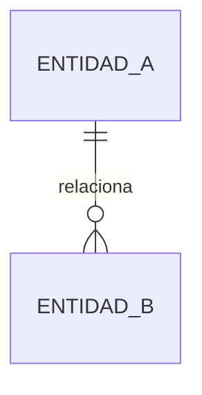

# SPEC: [Nombre de la funcionalidad]

## 1. Resumen y objetivo

[Describe el problema, el resultado esperado y el valor funcional de esta Spec.]

## 2. Alcance

### Incluido

- [Elemento incluido.]

### Fuera de alcance

- [Elemento excluido.]

## 3. Contexto y Clash Check

- **Código y módulos afectados:** [Rutas o módulos.]
- **Specs relacionadas:** [Referencias o “Ninguna”.]
- **ADRs relacionados:** [Referencias o “Ninguno”.]
- **Compatibilidad con decisiones existentes:** [Conflictos detectados y resolución propuesta, o “Sin conflictos”.]

## 4. Diseño funcional

### Actores y casos de uso

- [Actor]: [Caso de uso.]

### Flujo principal

1. [Paso.]

### Flujos alternativos y errores

- [Condición]: [Comportamiento esperado.]

## 5. Modelo de datos

### Esquema E-R



### Migraciones propuestas

| Tabla | Operación | Columna/índice | Tipo | Nulable | Regla o valor predeterminado |
| :--- | :--- | :--- | :--- | :--- | :--- |
| [tabla] | [crear/modificar] | [columna] | [tipo] | [sí/no] | [regla] |

## 6. Contratos técnicos

### API

| Método | Ruta | Autorización | Entrada | Respuesta | Errores |
| :--- | :--- | :--- | :--- | :--- | :--- |
| [GET/POST/…] | [/api/…] | [regla] | [DTO/esquema] | [estado y esquema] | [estados] |

### Clases y servicios

```text
[Clase::metodo(parametro: Tipo): TipoRetorno]
```

## 7. PageBuilder

### Estructura JSON

```json
{
  "type": "[tipo-componente]",
  "props": {}
}
```

### Reglas de compatibilidad

- [Versionado, valores predeterminados y comportamiento ante propiedades desconocidas.]

## 8. Lógica de negocio y validaciones

| Regla | Validación | Resultado ante incumplimiento |
| :--- | :--- | :--- |
| [regla] | [condición verificable] | [error o comportamiento] |

## 9. Seguridad y permisos

- **Autorización:** [Roles, Policies, permisos y denegaciones.]
- **Datos sensibles:** [Tratamiento, minimización, logs y riesgos.]
- **Configuración externa:** [Nombres de variables nuevas, finalidad y origen;
  nunca incluir secretos reales.]

## 10. Diseño y mantenibilidad

- **Fronteras y responsabilidades:** [Módulos o componentes responsables.]
- **Ejes de variación:** [Variantes actuales o previstas por la Spec.]
- **Decisiones de diseño:** [Capacidades de Laravel/Vue, patrones o solución
  simple elegida y justificación.]
- **Señales y excepciones:** [Code smells, deuda aceptada o “Ninguna”.]

## 11. Criterios de aceptación

- [ ] [Criterio observable y verificable.]

## 12. Estrategia de pruebas

| Criterio | Riesgo | Nivel | Caso feliz, límites y errores | Primer caso Red | Suite afectada |
| :--- | :--- | :--- | :--- | :--- | :--- |
| [CA-01] | [alto/medio/bajo] | [unitaria/integración/HTTP/componente/E2E] | [Casos] | [Prueba inicial o “No aplica”] | [Suite] |

- **Niveles no aplicables:** [Justificación; no crear pruebas artificiales.]
- **Coverage:** [Línea base o condición de no regresión si existe tooling.]

## 13. Incrementos verticales

1. [Comportamiento comprobable, criterio cubierto y quality gate.]

## 14. Decisiones pendientes

- [Decisión pendiente o “Ninguna”.]
