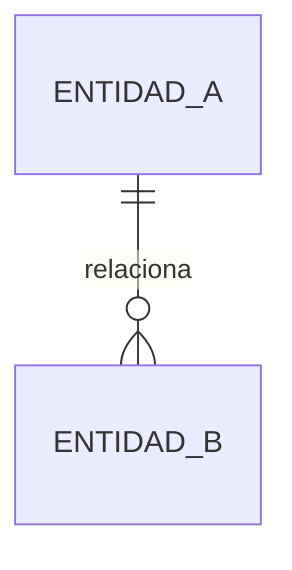

# SPEC: [Nombre de la funcionalidad]

## 1. Resumen y objetivo

[Describe el problema, el resultado esperado y el valor funcional de esta Spec.]

## 2. Alcance

### Incluido

- [Elemento incluido.]

### Fuera de alcance

- [Elemento excluido.]

## 3. Contexto y Clash Check

- **Código y módulos afectados:** [Rutas o módulos.]
- **Specs relacionadas:** [Referencias o “Ninguna”.]
- **ADRs relacionados:** [Referencias o “Ninguno”.]
- **Compatibilidad con decisiones existentes:** [Conflictos detectados y resolución propuesta, o “Sin conflictos”.]

## 4. Diseño funcional

### Actores y casos de uso

- [Actor]: [Caso de uso.]

### Flujo principal

1. [Paso.]

### Flujos alternativos y errores

- [Condición]: [Comportamiento esperado.]

## 5. Modelo de datos

### Esquema E-R



### Migraciones propuestas

| Tabla | Operación | Columna/índice | Tipo | Nulable | Regla o valor predeterminado |
| :--- | :--- | :--- | :--- | :--- | :--- |
| [tabla] | [crear/modificar] | [columna] | [tipo] | [sí/no] | [regla] |

## 6. Contratos técnicos

### API

| Método | Ruta | Autorización | Entrada | Respuesta | Errores |
| :--- | :--- | :--- | :--- | :--- | :--- |
| [GET/POST/…] | [/api/…] | [regla] | [DTO/esquema] | [estado y esquema] | [estados] |

### Clases y servicios

```text
[Clase::metodo(parametro: Tipo): TipoRetorno]
```

## 7. PageBuilder

### Estructura JSON

```json
{
  "type": "[tipo-componente]",
  "props": {}
}
```

### Reglas de compatibilidad

- [Versionado, valores predeterminados y comportamiento ante propiedades desconocidas.]

## 8. Lógica de negocio y validaciones

| Regla | Validación | Resultado ante incumplimiento |
| :--- | :--- | :--- |
| [regla] | [condición verificable] | [error o comportamiento] |

## 9. Seguridad y permisos

- [Políticas, roles, tratamiento de datos y riesgos.]

## 10. Criterios de aceptación

- [ ] [Criterio observable y verificable.]

## 11. Estrategia de pruebas

- **Unitarias:** [Casos.]
- **Integración:** [Casos.]
- **End-to-end:** [Casos.]

## 12. Decisiones pendientes

- [Decisión pendiente o “Ninguna”.]
