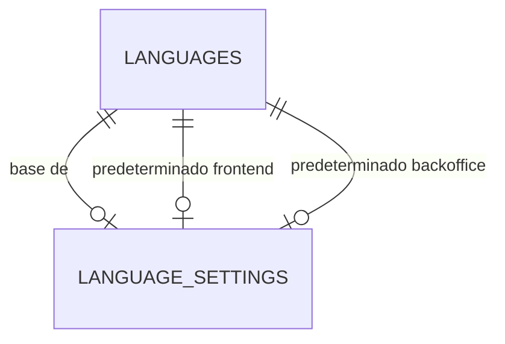

# SPEC: Fundación de idiomas estáticos y UI catalogs

- **Estado:** Aprobada
- **Perfil:** feature
- **Origen de la planificación:** Petición y decisiones del responsable del
  proyecto, resumidas en el
  [roadmap de localización](../architecture/localization-roadmap.md).
- **Spec relacionada:** [SPEC-module-foundation](SPEC-module-foundation.md), completada.

## 1. Objetivo o problema

Entregar el primer incremento vertical del sistema de idiomas: un módulo `Core`
capaz de registrar locales, mantener los predeterminados globales de frontend y
backoffice, resolver textos estáticos desde `UI catalogs` JSON y permitir el alta
manual y reproducible de un idioma sin utilizar el backoffice.

La instalación debe comenzar siempre con inglés neutro (`en`) como idioma base,
activo y no desinstalable. La resolución debe poder usar `en` como fallback o
mostrar la clave ausente, según configuración, para que producción degrade de
forma segura y los entornos de revisión detecten traducciones incompletas.

## 2. Contexto y evidencia

Laravel 13.31, PHP 8.5, Pest 5 y `nwidart/laravel-modules` 13 están instalados.
No existen módulos de dominio, tablas de idiomas ni `UI catalogs`. Laravel configura
actualmente `en` como locale y fallback mediante `config/app.php` y
`.env.example`.

Laravel admite `UI catalogs` JSON, placeholders, pluralización, selección de locale
y devolución literal de una clave ausente. nWidart registra traducciones desde
`Resources/lang` de cada módulo. El
[ADR-0002](../adr/ADR-0002-ui-catalogs-json-modulares.md) establece que los
textos estáticos del CMS se representarán mediante `UI catalogs` JSON con claves
estables y propietario explícito.

El SDD exige idiomas activos/inactivos y prefijos automáticos. Este incremento
resuelve el registro y los textos estáticos; la negociación HTTP, las URL y el
contenido editorial se aplazan a incrementos posteriores.

## 3. Alcance

- Crear el primer módulo de dominio `Core` mediante nWidart.
- Crear el registro persistente de idiomas y la configuración global de idioma.
- Instalar `en` como idioma base, activo y predeterminado de frontend y
  backoffice.
- Incorporar el `UI catalog` base de Core en JSON.
- Definir y validar el manifiesto de un idioma añadido manualmente.
- Permitir listar, instalar manualmente, activar y desactivar idiomas mediante
  comandos Artisan.
- Permitir cambiar los predeterminados globales de frontend y backoffice
  mediante Artisan.
- Resolver claves de Core con los modos de fallback `base` y `key`.
- Registrar de forma segura la ausencia de claves para diagnóstico.
- Documentar cómo añadir y verificar manualmente un idioma.

### Fuera de alcance

- Overrides de traducciones en base de datos.
- Interfaz de backoffice, autenticación, autorización y auditoría administrativa.
- Desinstalación de idiomas o eliminación de sus registros.
- Descarga, subida, firma, extracción o instalación web de paquetes de idioma.
- Preferencias persistentes asociadas al perfil de un usuario.
- Selección temporal por sesión, cookies persistentes y negociación desde
  `Accept-Language`.
- Prefijos de URL, URL amigables, items de menú y selector público de idioma.
- `Page`, `PageTranslation`, publicación en cascada y contenido editorial.
- PageBuilder, traducciones por plantilla o por instancia.
- Descubrimiento de templates, cuyo ciclo de vida aún no está definido.
- Implementar módulos custom adicionales para demostrar extensibilidad.

### Alcance diferido

- Los overrides se retomarán tras completar esta fundación, cuando exista un
  registro estable de locales y claves base contra el que validarlos.
- La selección temporal por sesión, la cookie persistente consentida y la
  negociación inicial del navegador se retomarán al definir el flujo HTTP de
  localización.
- Los prefijos y la precedencia entre URL, cookie, sesión, navegador y
  predeterminado se retomarán con URL amigables e items de menú.
- La auditoría durable se abordará antes de las primeras pantallas
  administrativas que modifiquen idiomas, overrides o configuración.
- Los `UI catalogs` de templates se incorporarán al definir su arquitectura,
  aplicando el mismo contrato que Core y los módulos.
- La instalación dinámica de paquetes se evaluará fuera del MVP/TFM. Deberá
  consumir el mismo formato JSON y manifiesto, sin ejecutar código del paquete.

## 4. *Clash check*

- SDD inicial: concreta el MUST de idiomas activos/inactivos y preserva el
  monolito modular. No contradice los prefijos automáticos, que quedan diferidos.
- ADR-0001: sin conflicto; este incremento no introduce Vue, SPA ni assets.
- ADR-0002: la Spec aplica el formato JSON, las claves estables, el propietario y
  la política de completitud aprobados para los `UI catalogs`.
- ADR-0003: la persistencia y sus pruebas aplican la baseline moderna de SQLite,
  MySQL y MariaDB y no amplían compatibilidad a versiones legacy.
- SPEC-module-foundation: satisface la condición de especificar responsabilidad,
  datos, contratos y pruebas antes de crear el primer módulo.
- Código y datos: no existen módulos, tablas ni `UI catalogs` previos incompatibles.
- Laravel/nWidart: las versiones instaladas permiten carga JSON y localización;
  la integración concreta quedará cubierta por pruebas.
- Roadmaps: localización y auditoría se mantienen como capacidades previstas, no
  disponibles. No hay conflicto irresoluble.

## 5. Requisitos y bloques técnicos aplicables

### Dominio e invariantes

- `en` es el único idioma base del CMS y su identidad no es configurable.
- `en` debe existir después de instalar o migrar el módulo `Core`.
- `en` no se puede desinstalar. Este incremento no ofrece ninguna operación de
  desinstalación para ningún idioma.
- Siempre debe existir al menos un idioma instalado y activo.
- Los predeterminados globales de frontend y backoffice deben referenciar un
  idioma instalado y activo.
- Un idioma predeterminado en cualquiera de los dos contextos no se puede
  desactivar.
- `en` puede desactivarse solamente si ha dejado de ser ambos predeterminados y
  permanece al menos otro idioma activo.
- Un idioma instalado manualmente queda inactivo hasta que se active mediante
  una operación separada.
- Todas las mutaciones que puedan afectar a estas invariantes deben ser atómicas
  y serializar cambios concurrentes sobre los registros implicados.

### Entidades y migraciones

La migración del módulo `Core` creará:

```text
languages
- id: bigint, PK
- locale: varchar(35), unique, not null
- name: varchar(100), not null
- native_name: varchar(100), not null
- text_direction: varchar(3), not null
- is_active: boolean, not null, default false
- installed_at: timestamp, not null
- created_at: timestamp, not null
- updated_at: timestamp, not null

language_settings
- id: bigint, PK, fixed 1, check (id = 1); solo se admite el registro global
- base_language_id: bigint, FK languages.id, restrict, unique, not null
- frontend_default_language_id: bigint, FK languages.id, restrict, not null
- backoffice_default_language_id: bigint, FK languages.id, restrict, not null
- created_at: timestamp, not null
- updated_at: timestamp, not null
```

Relaciones:



- `locale` usa el identificador canónico del CMS: `en`, `es_ES` y, cuando
  corresponda, componentes de script como `zh_Hant_TW`. Usa guiones bajos y no
  se presenta como una etiqueta HTTP BCP 47.
- La gramática admite idioma ISO 639 de dos o tres letras en minúsculas, script
  ISO 15924 opcional en Title Case y región ISO 3166-1 alfa-2 en mayúsculas o
  región UN M49 numérica opcional. LOC-05 definirá la conversión desde etiquetas
  BCP 47 de `Accept-Language`.
- `text_direction` solo admite `ltr` o `rtl` mediante validación de aplicación y
  restricción de base de datos portable cuando los motores soportados la
  representen de forma equivalente.
- La migración insertará `en`, activo, y un único `language_settings` que lo
  referencie en los tres roles.
- La base de datos debe imponer que `language_settings.id` sea siempre `1`
  mediante una restricción `CHECK` portable o una construcción equivalente con
  la misma garantía en SQLite, MySQL y MariaDB. La PK y la unicidad de
  `base_language_id` no sustituyen esta restricción singleton.
- El rollback elimina primero `language_settings` y después `languages`. No hay
  backfill porque las tablas no existen previamente.
- No se usarán borrados en cascada.
- El diseño y las migraciones deben funcionar en SQLite para desarrollo y en
  MySQL/MariaDB como persistencia objetivo.
- La matriz soportada por este incremento es SQLite `>= 3.45.0` para desarrollo
  y pruebas, MySQL `8.4.x LTS` y MariaDB `11.4.x LTS` para producción. MySQL y
  MariaDB deben usar el último patch mantenido de su serie; versiones anteriores,
  ramas Innovation o rolling y SQLite en producción quedan fuera de soporte.

### Módulo y contratos

- `Core` es propietario del registro de idiomas, las invariantes, los comandos y
  sus propios textos estáticos.
- Ningún módulo futuro debe escribir directamente los predeterminados ni evitar
  las operaciones de dominio de Core.
- Un `UI catalog` es un objeto JSON plano de claves y valores string.
- Las claves tienen propietario y siguen el formato
  `<owner>::<group>.<item>`, por ejemplo `core::auth.login.submit`.
- El identificador de propietario se normaliza en kebab-case y se registra antes
  de cargar líneas. `core` queda reservado para Core. Si dos identificadores de
  origen distintos producen el mismo identificador normalizado, el segundo se
  rechaza antes de registrar su `UI catalog`; nunca se fusionan propietarios por
  normalización.
- El `UI catalog` base `en` de un propietario contiene todas sus claves válidas.
- Una clave presente en otro locale pero ausente del `UI catalog` `en` del mismo
  propietario no se registra ni se resuelve. La validación debe informarla como
  error para evitar que un typo aparente estar soportado.
- Core debe aportar un `UI catalog` completo para cada idioma que declare instalado.
- Un módulo o template futuro debe aportar siempre su `UI catalog` `en`, pero puede
  omitir cualquier otro locale. Si declara otro locale, ese `UI catalog` debe ser
  completo respecto de su propio `en`.
- Los overrides futuros podrán aportar valores individuales para locales que un
  módulo o template no distribuya, pero no podrán crear claves ausentes de su
  `UI catalog` `en`.
- El `UI catalog` `en` es el inventario de claves declaradas por su propietario.
  Toda llamada a una clave introducida por este incremento debe tener una prueba
  que demuestre que se resuelve en `en`. No se parseará Blade mediante regex. Al
  aparecer UI real, el modo `key` y las pruebas HTTP/E2E ampliarán esa garantía.

### Manifiesto de alta manual

El comando de instalación recibe la ruta local de un manifiesto JSON ya
desplegado por un administrador. El manifiesto usa este contrato versionado:

```json
{
  "schema_version": 1,
  "locale": "es_ES",
  "name": "Spanish (Spain)",
  "native_name": "Español (España)",
  "text_direction": "ltr",
  "catalogs": {
    "core": true
  }
}
```

- `catalogs` declara propietarios habilitados mediante valores booleanos, no
  rutas aportadas por el usuario.
- En este incremento el manifiesto debe declarar exactamente `core` y el comando
  resuelve su archivo mediante la convención interna de Core:
  `Modules/Core/Resources/lang/<locale>.json`.
- El manifiesto debe ser un archivo regular JSON; se rechazan enlaces simbólicos,
  dispositivos, rutas inexistentes y entradas que no sean archivos.
- El `UI catalog` también debe ser un archivo regular, no un enlace simbólico, y
  su ruta canónica debe permanecer dentro de `Modules/Core/Resources/lang`.
- El `UI catalog` debe ser completo respecto del `UI catalog` base `en` de Core.
- Se rechazan schema desconocido, JSON inválido, locale duplicado, claves
  faltantes, claves ajenas al `UI catalog` base, tipos no string, valores vacíos,
  UTF-8 inválido, placeholders incompatibles y pluralización incompatible.
- El manifiesto no puede superar 64 KiB; el `UI catalog` no puede superar 2 MiB ni
  10.000 claves; una clave no puede superar 191 caracteres y un valor no puede
  superar 16.384 caracteres. Los límites se miden antes de registrar datos.
- El alta manual registra el idioma después de validar el `UI catalog` ya desplegado
  en la ubicación convencional. No descarga, copia, extrae ni ejecuta contenido.

### Comandos Artisan

Contratos públicos del incremento:

```text
cms:language:list
cms:language:install {manifest}
cms:language:validate {locale?}
cms:language:activate {locale}
cms:language:disable {locale}
cms:language:set-default {context} {locale}
```

- `context` solo acepta `frontend` o `backoffice`.
- Los comandos exitosos terminan con código `0` y muestran el estado resultante
  sin incluir contenido completo del `UI catalog`.
- Entrada inválida, `UI catalog` inválido, idioma desconocido o transición prohibida
  terminan con un código distinto de `0` y un mensaje accionable.
- Repetir la instalación del mismo locale no modifica datos y falla de forma
  explícita.
- `cms:language:validate` comprueba de nuevo los archivos desplegados, todos los
  idiomas si se omite `locale`, y no modifica datos ni archivos.
- Los comandos no solicitan confirmación interactiva, para que puedan probarse y
  automatizarse de manera determinista.

### Resolución y configuración

La opción `CMS_UI_CATALOG_FALLBACK_MODE` admite únicamente:

- `base`: `UI catalog` solicitado y después `en`.
- `key`: solo `UI catalog` solicitado.

La precedencia de este incremento, sin overrides, es:

```text
UI catalog del locale solicitado
-> UI catalog en, solo en modo base
-> clave literal
```

- Si la variable no está definida, el valor efectivo será `base` cuando
  `APP_ENV=production` y `key` en los demás entornos.
- `.env.example`, tests y E2E fijarán explícitamente `key`; la guía de producción
  documentará `base`. Una configuración explícita válida puede cambiar esa
  política en cualquier entorno.
- Un valor de configuración desconocido debe impedir un arranque silencioso con
  una política distinta: se rechazará con un error de configuración accionable.
- La configuración debe funcionar con `config:cache`; no se leerá `env()` fuera
  de archivos de configuración.
- Una clave ausente se devuelve literalmente y no provoca por sí sola un error
  HTTP.
- El diagnóstico de ausencias incluye clave, locale y propietario, pero no
  replacements, contenido editorial, sesión ni datos personales. Debe limitar o
  deduplicar repeticiones para no facilitar agotamiento de logs.

### Integridad y actualización de UI catalogs

- Los archivos siguen siendo entrada no confiable después del alta. El loader
  valida y filtra cada `UI catalog` antes de registrarlo en el traductor.
- Cada carga lee una única instantánea de bytes; sobre esos mismos bytes calcula
  el hash, decodifica, valida y registra las líneas. No vuelve a abrir el archivo
  entre esas operaciones.
- La caché de validación se identifica por hashes SHA-256 del `UI catalog` base y
  del localizado. Cambiar cualquiera invalida la entrada y fuerza revalidación.
- Un `UI catalog` que deje de ser completo o válido no se carga parcialmente. La
  resolución degrada mediante `en` en modo `base` o mediante la clave en modo
  `key`, y emite un diagnóstico limitado sin valores del `UI catalog`.
- Las claves localizadas ausentes de `en` nunca se registran, incluso si el
  archivo cambia después del alta.
- `cms:language:validate` debe ejecutarse en despliegue y CI para detectar la
  degradación antes de servir tráfico.
- Añadir o retirar claves de `en` obliga a revalidar todos los idiomas y a
  actualizar sus `UI catalogs` completos en el mismo cambio cuando formen parte
  del repositorio.

### Placeholders y pluralización

- Los placeholders usan la sintaxis Laravel `:name` y deben coincidir por nombre
  con los de `en`; se permiten cambios de orden y capitalización soportados por
  Laravel.
- El carácter `|` queda reservado como separador de pluralización. Un valor que
  lo necesite literalmente queda fuera de este primer contrato.
- Si el valor `en` usa pluralización, todos sus valores localizados deben usar
  una expresión válida para `trans_choice`; si no la usa, tampoco pueden
  introducirla.
- Cada locale puede definir distinta cantidad de formas e intervalos. No se exige
  replicar la estructura inglesa, solo sintaxis válida para Laravel y el mismo
  conjunto de placeholders, además de `:count` cuando corresponda.

### Seguridad y contenido

- Los `UI catalogs` y manifiestos son datos JSON; nunca se ejecutan como PHP,
  plantillas o JavaScript.
- Las claves y locales se validan contra formatos cerrados antes de resolver
  rutas o consultar `UI catalogs`.
- Las traducciones se consideran texto y se escapan al renderizar con Blade. El
  incremento no admite HTML en valores.
- Los placeholders permitidos son los del `UI catalog` base y deben coincidir por
  nombre en cada traducción.
- No se registran valores de traducción completos ni replacements en logs.
- No se incorporan secretos ni variables con valores reales.
- La instalación web, archivos comprimidos, firmas y procedencia remota quedan
  fuera de alcance y no deben simularse mediante el comando manual.

### API, Vue 3 y PageBuilder

No aplicable: el incremento no introduce rutas HTTP, contratos JSON de API,
componentes Vue ni schemas o contenido del PageBuilder.

### Asincronía e integraciones externas

No aplicable: todas las operaciones son locales y síncronas; no hay colas ni
servicios externos.

## 6. Calidad, seguridad y deuda

### Garantías obligatorias

- Aplicar TDD a cada invariante y variante de resolución porque las matrices de
  estado y fallback aportan casos aislables con resultado determinista.
- Probar el modelo y las migraciones mediante ejecución real en SQLite
  `>= 3.45.0`, MySQL `8.4.x LTS` y MariaDB `11.4.x LTS`, sin depender de índices
  parciales específicos.
- La matriz de CI debe consultar y registrar la versión efectiva de cada motor,
  fallar si queda fuera de la baseline y ejecutar la misma prueba de integración
  de la migración en los tres motores.
- En cada entrada de la matriz, probar a nivel de base de datos que no puede
  existir un segundo registro de `language_settings`: insertar explícitamente
  `id = 2` debe producir una violación de restricción y no dejar ninguna fila
  adicional. Verificar solo el SQL generado o ejecutar el caso únicamente en
  SQLite no satisface esta garantía.
- Probar `UI catalogs` válidos, incompletos, sobredimensionados, con claves extra,
  placeholders incompatibles, pluralización incompatible, JSON inválido y rutas
  inseguras.
- Probar cambios posteriores al alta, cambios en `en`, invalidación por hash y
  degradación segura de un archivo que deja de ser válido.
- Probar todas las transiciones permitidas y denegadas de activación y
  predeterminados, incluida concurrencia o serialización equivalente.
- Probar ambos modos de fallback y la devolución literal de la clave.
- Ejecutar pruebas enfocadas, suite afectada, Pint, build frontend y controles de
  seguridad configurados, aunque el incremento no modifique Vue.
- Documentar instalación, configuración, alta manual, diagnóstico y extensión
  del formato sin presentar como disponible la instalación dinámica.

### Riesgos aceptados

- El alta manual requiere desplegar archivos y ejecutar Artisan. Se acepta para
  el MVP porque evita una superficie de subida y extracción antes de disponer de
  backoffice, autorización, auditoría y distribución confiable.
- En modo `base`, una ausencia puede quedar visualmente en inglés. Se acepta en
  producción por resiliencia y se mitiga usando `key` en desarrollo, tests y E2E
  junto con validación estructural obligatoria.
- Una clave literal puede revelar nomenclatura interna no sensible. Se acepta
  como degradación segura; las claves no contendrán secretos, datos personales
  ni detalles de infraestructura.

### Deuda técnica

- No aplica. Los incrementos diferidos no son necesarios para que esta fundación
  sea correcta y tienen condición de entrada explícita en el roadmap.

## 7. Criterios de aceptación

- **CA-01:** Una instalación limpia crea el módulo Core, registra `en` activo y
  lo configura como base y predeterminado global de frontend y backoffice; la
  matriz de SQLite `>= 3.45.0`, MySQL `8.4.x LTS` y MariaDB `11.4.x LTS` verifica
  la versión efectiva y demuestra que la base de datos rechaza insertar un
  segundo `language_settings` con `id = 2` sin alterar el singleton existente.
- **CA-02:** El sistema resuelve una clave existente del `UI catalog` Core para
  el locale solicitado sin ejecutar contenido del `UI catalog`.
- **CA-03:** En modo `base`, una clave ausente en un locale instalado usa el valor
  `en`; en modo `key`, devuelve la clave literal sin consultar `en`.
- **CA-04:** Un manifiesto y `UI catalog` Core válidos registran manualmente un nuevo
  idioma inactivo; repetir el alta o proporcionar contenido inválido no modifica
  datos y termina con error.
- **CA-05:** Solo un idioma instalado e inactivo puede activarse, y la activación
  deja al menos un idioma activo sin alterar los predeterminados.
- **CA-06:** Solo un idioma activo puede seleccionarse como predeterminado de
  frontend o backoffice, y el cambio es atómico.
- **CA-07:** No se puede desactivar un idioma predeterminado, ni dejar el sistema
  sin idiomas activos; `en` solo puede desactivarse cuando cumple ambas reglas.
- **CA-08:** Una clave localizada que no exista en el `UI catalog` base `en` del
  mismo propietario es rechazada durante la validación y nunca se resuelve.
- **CA-09:** Los comandos listan estado y comunican errores mediante códigos de
  salida deterministas sin mostrar `UI catalogs` completos ni datos sensibles.
- **CA-10:** La documentación permite a un administrador añadir manualmente un
  idioma y a un desarrollador crear un `UI catalog` compatible, distinguiendo lo
  disponible de los paquetes dinámicos diferidos.
- **CA-11:** Si un `UI catalog` desplegado o el `UI catalog` base cambia después
  del alta, el sistema invalida su caché, revalida ambos archivos y nunca carga
  claves incompletas, desconocidas o inválidas.

## 8. Trazabilidad de pruebas y documentación

| Criterio | Riesgo cubierto | Nivel de prueba | Evidencia esperada | Impacto documental |
| :--- | :--- | :--- | :--- | :--- |
| CA-01 | Instalación sin idioma utilizable o singleton no impuesto por un motor | Integración/BD multi-motor | Versión efectiva, migración, registros iniciales y rechazo de `id = 2` verificados en SQLite, MySQL y MariaDB | Requisitos de instalación y guía de idiomas |
| CA-02 | `UI catalog` no integrado o ejecutable | Integración | Clave Core resuelta desde JSON | Guía de `UI catalogs` |
| CA-03 | Fallback oculta ausencias o degrada mal | Integración | Matriz `base`/`key` verificada | Configuración y diagnóstico |
| CA-04 | Alta parcial, duplicada o insegura | Integración/BD | Casos válidos e inválidos sin escritura parcial | Administración manual |
| CA-05 | Activación de locale inválido | Integración/BD | Transiciones de activación verificadas | Administración manual |
| CA-06 | Predeterminado inactivo o carrera | Integración/BD | Cambio atómico y rechazo de inactivos | Administración manual |
| CA-07 | Sistema sin locale activo | Integración/BD | Desactivaciones prohibidas verificadas | Administración manual |
| CA-08 | Claves huérfanas o typos | Unit/integración | Comparación con base y rechazo | Guía de `UI catalogs` |
| CA-09 | Automatización ambigua o fuga en consola | Feature/console | Código y salida de cada comando | Referencia de comandos |
| CA-10 | Operación dependiente de conocimiento implícito | Validación documental | Procedimiento y ejemplos revisados | Roadmap y guías nuevas |
| CA-11 | Archivo alterado después de validarse | Integración/filesystem | Hash, revalidación y degradación segura | Despliegue y diagnóstico |

HTTP, componente Vue y E2E no aplican en este incremento porque no existe
interfaz web. El futuro flujo HTTP deberá añadirlos. La comprobación de modo
`key` en E2E se activará cuando exista una UI localizada.

## 9. Plan de implementación

1. Crear pruebas rojas para la instalación limpia de Core y sus registros base;
   generar el módulo, migraciones y modelo mínimos y configurar la matriz de
   SQLite, MySQL y MariaDB con comprobación de versiones hasta cumplir CA-01.
2. Crear pruebas rojas de resolución JSON y modos `base`/`key`; implementar el
   `UI catalog` Core y la política de fallback hasta cumplir CA-02 y CA-03.
3. Crear pruebas rojas del manifiesto, validación y seguridad de rutas;
   implementar el alta manual, revalidación e invalidación por hash hasta cumplir
   CA-04, CA-08 y CA-11.
4. Crear pruebas rojas de comandos y transiciones; implementar listado,
   activación, desactivación y predeterminados hasta cumplir CA-05 a CA-09.
5. Documentar instalación, configuración, diagnóstico y extensión; validar
   CA-10 y actualizar estado y changelog al completar la implementación.
6. Ejecutar pruebas enfocadas, suite, formato, build y controles de seguridad;
   revisar migraciones, diff, secretos y compatibilidad documental.

## 10. Decisiones abiertas

- No aplica. La inspección de Laravel 13 y nWidart 13 confirma la carga de JSON y
  la extensión del traductor mediante rutas y líneas adicionales. Cualquier
  desviación descubierta durante TDD que obligue a cambiar el contrato, el ADR o
  el comportamiento esperado requerirá actualizar y aprobar de nuevo esta Spec.
